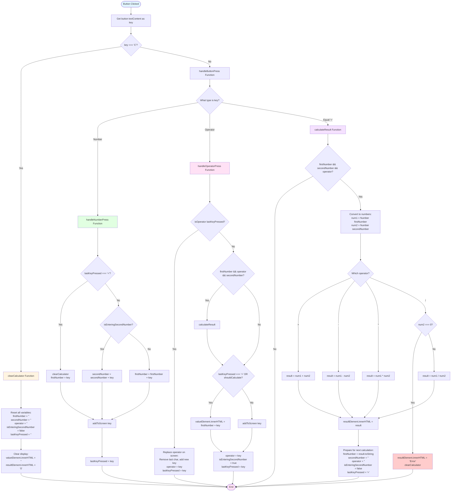

# Calculator Flowchart

This flowchart represents the logic flow of the calculator JavaScript code (lines 76-231).

## Key Functions Overview

### 1. **Button Click Handler** (lines 89-99)

- Sets up event listeners for all buttons
- Routes "C" button to `clearCalculator()`
- Routes all other buttons to `handleButtonPress()`

### 2. **clearCalculator()** (lines 102-110)

- Resets all state variables to empty strings/false
- Clears the display screens

### 3. **handleButtonPress()** (lines 129-140)

- Routes to appropriate handler based on button type:
  - Numbers → `handleNumberPress()`
  - Operators → `handleOperatorPress()`
  - Equals → `calculateResult()`

### 4. **handleNumberPress()** (lines 143-157)

- Handles logic for entering numbers
- Checks if starting fresh after "="
- Adds to firstNumber or secondNumber based on state
- Updates display and lastKeyPressed

### 5. **handleOperatorPress()** (lines 160-189)

- Replaces operator if last key was also an operator
- Calculates previous result if calculation is complete
- Updates display and sets operator state

### 6. **calculateResult()** (lines 192-230)

- Validates all required values exist
- Performs calculation based on operator
- Handles division by zero error
- Shows result and prepares state for next calculation

## State Variables

- `firstNumber`: Stores the first operand
- `secondNumber`: Stores the second operand
- `operator`: Stores the current operator (+, -, \*, /)
- `isEnteringSecondNumber`: Boolean flag indicating input phase
- `lastKeyPressed`: Tracks the last button pressed for context
